# 第一部分 Pandas入门

## 第1章 Pandas简介及快速入门

### 1.3 Pandas快速入门

#### 1.3.3 读取数据

~~~python
import pandas as pd # 引入Pandas库，按惯例起别名pd

# 以下两种效果一样，如果是网址，它会自动将数据下载到内存
df = pd.read_excel('https://www.gairuo.com/file/data/dataset/team.xlsx')
df = pd.read_excel('team.xlsx') # 文件在notebook文件同一目录下
# 如果是CSV，使用pd.read_csv()，还支持很多类型的数据读取
~~~

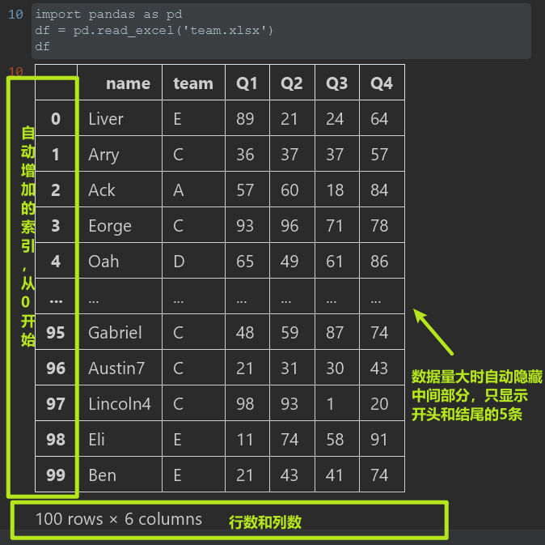

#### 1.3.4 查看数据

~~~python
df.head() # 查看前5条，括号里可以写明你想看的条数
df.tail() # 查看尾部5条
df.sample(5) # 随机查看5条，不传入参数时默认查看1条
~~~

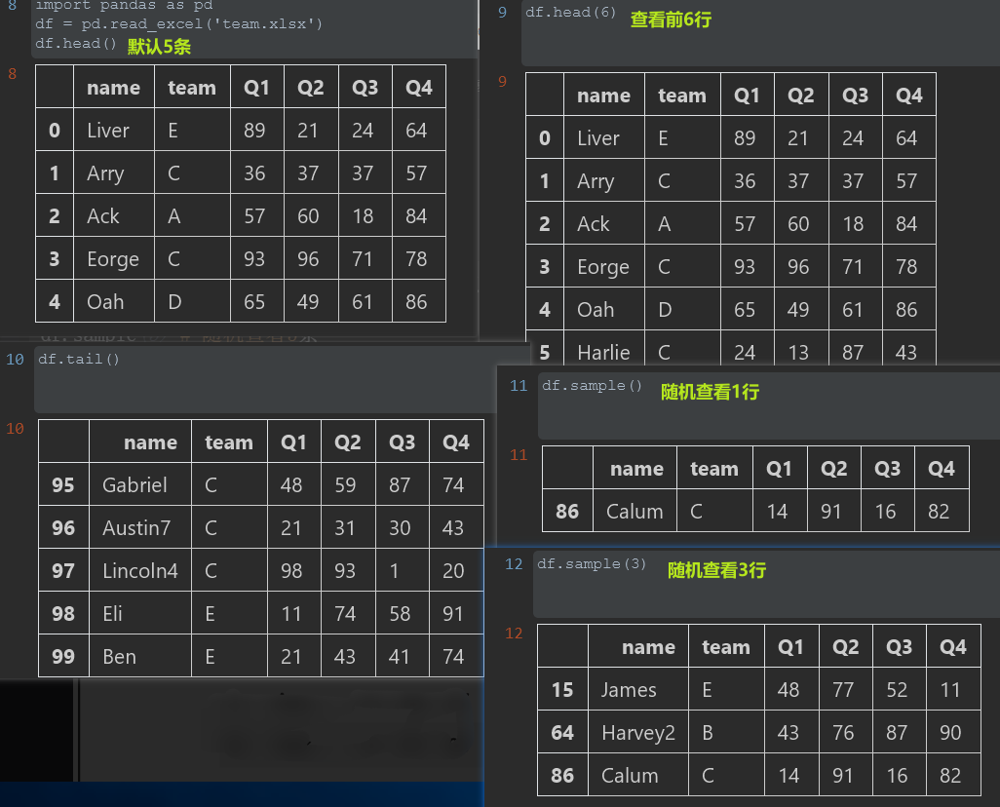

#### 1.3.5 验证数据

~~~python
df.shape # (100, 6) 查看行数和列数
df.info() # 查看索引、数据类型和内存信息
df.describe() # 查看数值型列的汇总统计
df.dtypes # 查看各字段类型
df.axes # 显示数据行和列名
df.columns # 列名
~~~

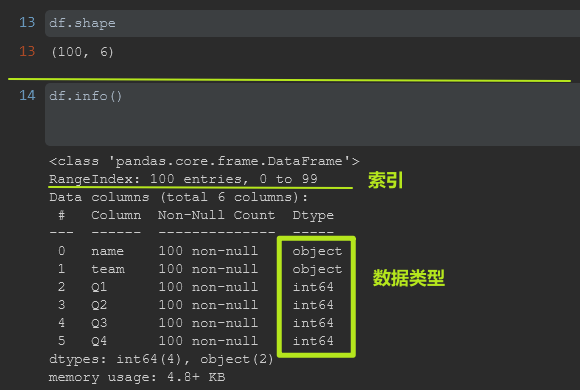

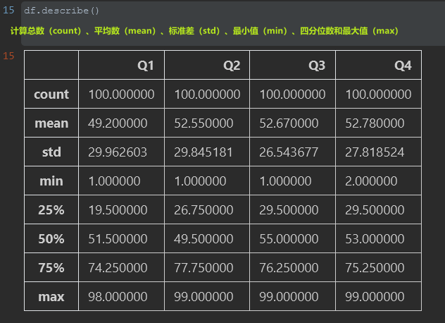

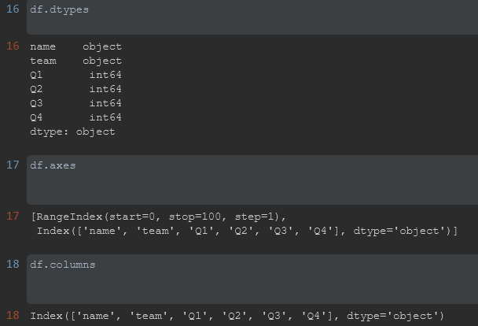

#### 1.3.6 建立索引

~~~python
df.set_index('name', inplace=True) # 以name列建立索引并生效
~~~

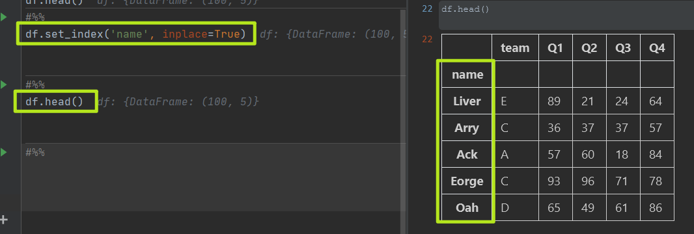

#### 1.3.7 数据选取

1. ##### 选择列

   ~~~python
      df['Q1']
      df.Q1 # 同上，如果列名符合Python变量名要求，可使用
   '''
   df.Q1
   Out:
   0     89
   1     36
   2     57
   3     93
   4     65
         ..
   95    48
   96    21
   97    98
   98    11
   99    21
   Name: Q1, Length: 100, dtype: int64
   '''
   ~~~

这里返回的是一个Series类型数据，可以理解为数列，它也是带索引的。之前建立的索引在这里发挥出了作用，否则我们的索引是一个数字，无法知道与之对应的是谁的数据。

###### 选择多列

~~~python
# 选择多列
df[['team', 'Q1']] # 只看这两列，注意括号
df.loc[:, ['team', 'Q1']] # 和上一行效果一样
~~~

df.loc[x, y]是一个非常强大的数据选择函数，其中x代表行，y代表列，行和列都支持条件表达式，也支持类似列表那样的切片（如果要用自然索引，需要用df.iloc[]）。

2. ##### 选择行

   ~~~python
   # 用指定索引选取
   df[df.index == 'Liver'] # 指定姓名
   
   # 用自然索引选择，类似列表的切片
   df[0:3] # 取前三行
   df[0:10:2] # 在前10个中每两个取一个
   df.iloc[:10,:] # 前10个
   ~~~

   

3. ##### 指定行和列

   ~~~python
   df.loc['Ben', 'Q1':'Q4'] # 只看Ben的四个季度成绩
   df.loc['Eorge':'Alexander', 'team':'Q4'] # 指定行区间
   ~~~

   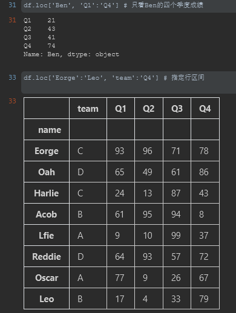

4. ##### 条件选择

   ~~~python
   # 单一条件
   df[df.Q1 > 90] # Q1列大于90的
   df[df.team == 'C'] # team列为'C'的
   df[df.index == 'Oscar'] # 指定索引即原数据中的name
   
   # 组合条件
   df[(df['Q1'] > 90) & (df['team'] == 'C')] # and关系
   df[df['team'] == 'C'].loc[df.Q1>90] # 多重筛选
   ~~~

   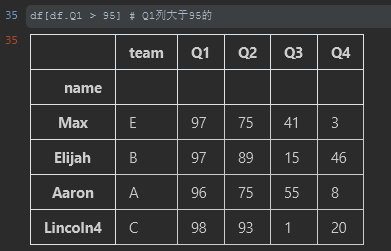

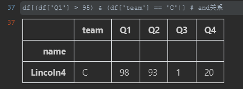

#### 1.3.8 排序

~~~python
df.sort_values(by='Q1') # 按Q1列数据升序排列
df.sort_values(by='Q1', ascending=False) # 降序

df.sort_values(['team', 'Q1'], ascending=[True, False]) # team升序，Q1降序
~~~

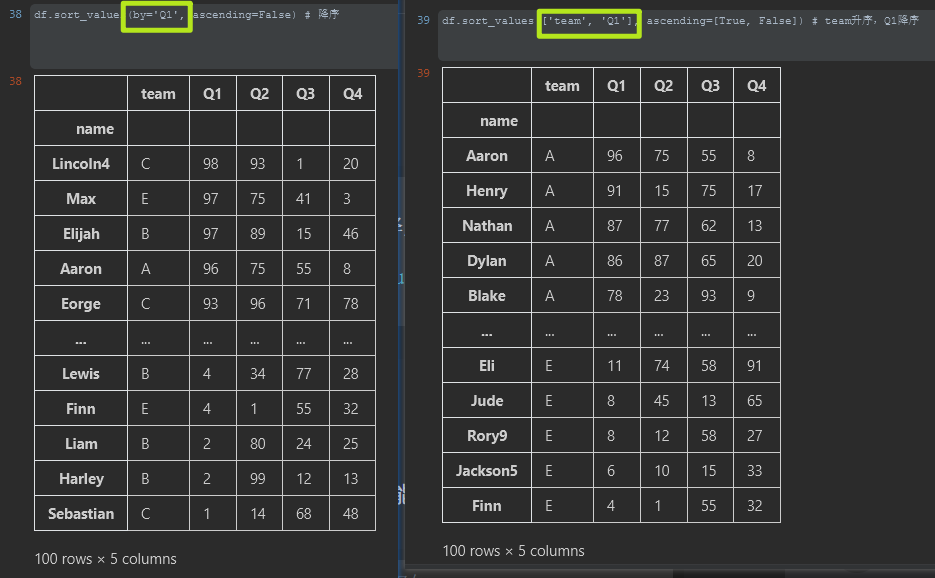

#### 1.3.9 分组聚合

~~~python
df.groupby('team').sum() # 按团队分组对应列相加
df.groupby('team').mean() # 按团队分组对应列求平均
# 不同列不同的计算方法
df.groupby('team').agg({'Q1': sum,  # 总和
                        'Q2': 'count', # 总数
                        'Q3':'mean', # 平均
                        'Q4': max}) # 最大值
~~~

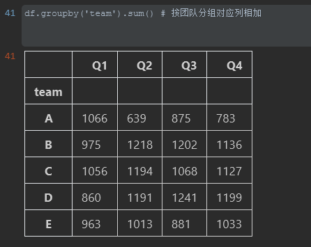

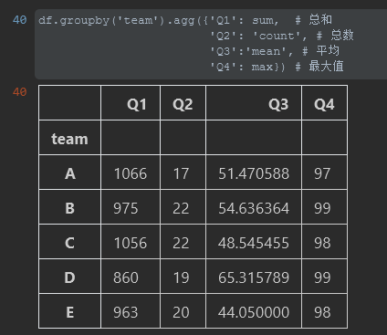

#### 1.3.10 数据转换

~~~python
df.groupby('team').sum().T	# T行列转置
~~~

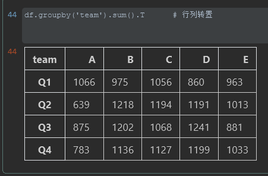

~~~python
df.groupby('team').sum().stack()
df.groupby('team').sum().unstack()
~~~

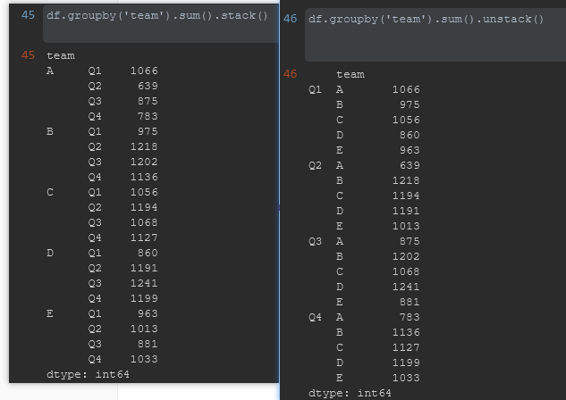

#### 1.3.11 增加列

~~~python
df['one'] = 1 # 增加一个固定值的列
df['total'] = df.Q1 + df.Q2 + df.Q3 + df.Q4 # 增加总成绩列
# 将计算得来的结果赋值给新列
df['total'] = df.loc[:,'Q1':'Q4'].apply(lambda x:sum(x), axis=1)
df['total'] = df.sum(axis=1) # 可以把所有为数字的列相加
df['avg'] = df.total/4 # 增加平均成绩列
~~~

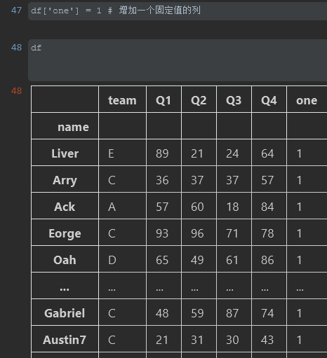

#### 1.3.12 统计分析

~~~python
df.mean() # 返回所有列的均值
df.mean(1) # 返回所有行的均值，下同
df.corr() # 返回列与列之间的相关系数
df.count() # 返回每一列中的非空值的个数
df.max() # 返回每一列的最大值
df.min() # 返回每一列的最小值
df.median() # 返回每一列的中位数
df.std() # 返回每一列的标准差
df.var() # 方差
s.mode() # 众数
~~~

#### 1.3.13 绘图

#### 1.3.14 导出

~~~python
# 导出的文件位于notebook文件的同一目录下
df.to_excel('team-done.xlsx') # 导出 Excel文件
df.to_csv('team-done.csv') # 导出 CSV文件
~~~

## 第2章 数据结构

### 2.3 Numpy

#### 2.3.1 Numpy简介

NumPy是Python的一个高性能矩阵运算的科学计算库。它的主要用途是以数组的形式进行数据操作和数学运算，数据分析、机器学习大都是进行数学计算。Pandas依赖NumPy，在安装它时会自动安装NumPy。Pandas的数据结构和运算的底层工作都交由NumPy来完成。但是，我们不需要过多关注NumPy的功能，直接使用Pandas的功能就可以，也不需要从NumPy的基础开始学习，这部分内容可以跳过，在学习过程中有需要再来查看。

NumPy（官网https://numpy.org）是Python的科学计算包，代表Numeric Python。NumPy是Python中科学计算的基本软件包。它是一个Python库，提供多维数组对象以及蒙版数组和矩阵等各种派生对象，用于对数组进行快速便捷的操作，包括数学、逻辑、形状处理、排序、选择、I/O、离散傅立叶变换、基本线性代数、基本统计运算、随机模拟等。可以说，NumPy是数据科学中必不可少的工具。由于NumPy对数据进行向量化描述，没有任何显式的循环操作，所以执行速度更快，代码更加简洁优雅，出错率更低。NumPy提供了两个基本的对象。ndarray：存储数据的多维数组。ufunc：对数组进行处理的函数。

### 2.4 Pandas的数据结构

#### 2.4.1 Series

Series（系列、数列、序列）是一个带有标签的一维数组，这一系列连续的数据代表了一定的业务意义。如以下各国2019年的GDP就是一个典型的Series。

~~~python
中国  14.34
美国  21.43
日本  5.08
dtype: float64
~~~

其中，国家是标签（也称索引），不是具体的数据，它起到解释、定位数据的作用。如果没有标签，只有一个数字，是不具有业务意义的。Series是Pandas最基础的数据结构。

#### 2.4.2 DataFrame

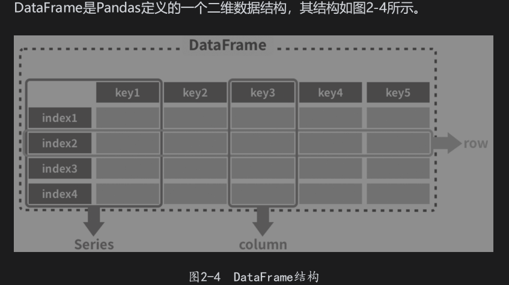

横向的称作行（row），我们所说的一条数据就是指其中的一行；

纵向的称作列（column）或者字段，是一条数据的某个值；

第一行是表头，或者叫字段名，**类似于Python字典里的键**，代表数据的属性；

第一列是索引，就是这行数据所描述的主体，也是这条数据的关键；

在一些场景下，表头和索引也称为列索引和行索引；行索引和列索引可能会出现多层索引的情况。

我们给上例国家GDP Series数据中增加一列“人口”，形成一个DataFrame：

~~~python
       人口    GDP
中国  13.97  14.34
美国   3.28  21.43
日本   1.26   5.08
~~~

这就是一个典型的DataFrame结构，其中：

共有三行两列（不包含索引）数据；

国家所在列是这个表的索引，每一行数据的主体为这个国家；

每条数据（横向）有两个值，分别是人口和GDP。

#### 2.4.3 索引

**索引（index）**：行和列上的标签，标识二维数据坐标的行索引和列索引，默认情况下，指的是每一行的索引。如果是Series，那只能是它行上的索引。**列索引又被称为字段名、表头**。

**自然索引、数字索引**：行和列的0～n（n为数据长度–1）形式的索引，数据天然具有的索引形式。虽然可以指定为其他名称，但在有些方法中依然可以使用。

**标签（label）**：行索引和列索引，如果是Series，那只能是它行上的索引。

**轴（axis）**：仅用在DataFrame结构中，代表数据的方向，如行和列，用0代表列（默认），1代表行。

### 2.5 Pandas生成数据

#### 2.5.1 导入Pandas

~~~python
import pandas as pd
import numpy as np
~~~

#### 2.5.2 创建数据

使用DataFrame()方法创建DataFrame，参数为字典格式

~~~python
df = pd.DataFrame({'国家': ['中国', '美国', '日本'],
                   '地区': ['亚洲', '北美', '亚洲'],
                   '人口': [13.97, 3.28, 1.26],
                   'GDP': [14.34, 21.43, 5.08],
                  })
~~~

字典中，每条数据为一个Series，**键为表头（列索引）**，**值为具体数据**。

~~~js
   国家  地区   人口    GDP
0  中国  亚洲  13.97  14.34
1  美国  北美   3.28  21.43
2  日本  亚洲   1.26   5.08
~~~

DataFrame可以容纳Series，所以在定义DataFrame时可以使用Series，也可以利用NumPy的方法：

~~~python
df2 = pd.DataFrame({'A': 1.,
                    'B': pd.Timestamp('20130102'),
                    'C': pd.Series(1, index=list(range(4)), dtype='float32'),
                    'D': np.array([3] * 4, dtype='int32'),
                    'E': pd.Categorical(["test", "train", "test", "train"]),
                    'F': 'foo'})
df2
'''
     A          B    C  D      E    F
0  1.0 2013-01-02  1.0  3   test  foo
1  1.0 2013-01-02  1.0  3  train  foo
2  1.0 2013-01-02  1.0  3   test  foo
3  1.0 2013-01-02  1.0  3  train  foo
'''
~~~

从DataFrame中选取一列就会返回一个Series，当然选择多列的话依然是DataFrame。

#### 2.5.3 生成Series

Series是一个带有标签的一维数组，这个数组可以由任何类型数据构成，包括整型、浮点、字符、Python对象等。它的轴标签被称为索引，它是Pandas最基础的数据结构。

Series的创建方式如下：

~~~python
s = pd.Series(data, index=index)
~~~

data可以是Python对象、NumPy的ndarray、一个标量（定值，如8）。index是轴上的一个列表，必须与data的长度相同，如果没有指定，则自动从0开始，表示为[0, …, len(data)–1]。

1. ##### 使用列表和元组

   ~~~python
   pd.Series(['a', 'b', 'c', 'd', 'e'])
   pd.Series(('a', 'b', 'c', 'd', 'e'))
   ~~~

   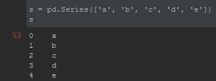

2. ##### 使用ndarray

   ~~~python
   # 由索引分别为a、b、c、d、e的5个随机浮点数数组组成
   s = pd.Series(np.random.randn(5), index=['a', 'b', 'c', 'd', 'e'])
   s.index # 查看索引
   s = pd.Series(np.random.randn(5)) # 未指定索引		
   ~~~

3. ##### 使用字典

   ~~~python
   d = {'b': 1, 'a': 0, 'c': 2}
   s = pd.Series(d)
   s
   '''
   b    1
   a    0
   c    2
   dtype: int64
   '''
   
   # 如果指定索引，则会按索引顺序，如有无法与索引对应的值，会产生缺失值
   pd.Series(d, index=['b', 'c', 'd', 'a'])
   '''
   b    1.0
   c    2.0
   d    NaN
   a    0.0
   dtype: float64
   '''
   ~~~

4. ##### 使用标量

   对于一个具体的值，如果不指定索引，则其长度为1；如果指定索引，则其长度为索引的数量，每个索引的值都是它。.

   ~~~python
   pd.Series(5.)
   '''
   0    5.0
   dtype: float64
   '''
   
   # 指定索引
   pd.Series(5., index=['a', 'b', 'c', 'd', 'e'])
   '''
   a    5.0
   b    5.0
   c    5.0
   d    5.0
   e    5.0
   dtype: float64
   '''
   ~~~

#### 2.5.4 生成DataFrame

DataFrame最基本的定义格式如下：

~~~python
df = pd.DataFrame(data=None, index=None, columns=None)
~~~

data：具体数据，结构化或同构的ndarray、可迭代对象、字典或DataFrame。

index：索引，类似数组的对象，支持解包，如果没有指定，会自动生成RangeIndex (0, 1, 2, …, n)。

columns：列索引、表头，如果没有指定，会自动生成RangeIndex (0, 1, 2, …,n)。

此外还可以用dtype指定数据类型，如果未指定，系统会自动推断。

1. ##### 字典

   字典中的键为列名，值一般为一个列表或者元组，是具体数据。

   ~~~python
   d = {'国家': ['中国', '美国', '日本'],
        '人口': [14.33, 3.29, 1.26]}
   df = pd.DataFrame(d)
   df
   '''
      国家    人口
   0  中国  13.97
   1  美国   3.28
   2  日本   1.26
   '''
   ~~~

   如果生成时指定了索引名称，会使用指定的索引名，如a、b、c。示例如下。

   ~~~python
   df = pd.DataFrame(d, index=['a', 'b', 'c'])
   df
   '''
      国家    人口
   a  中国  13.97
   b  美国   3.28
   c  日本   1.26
   '''
   ~~~

2. ##### Series组成的字典

   这是一种非常典型的构造数据的方法，字典里的一个键值对为一列数据，键为列名，值是一个Series。

   ~~~python
   d = {'x': pd.Series([1., 2., 3.], index=['a', 'b', 'c']),
        'y': pd.Series([1., 2., 3., 4.], index=['a', 'b', 'c', 'd'])}
   df = pd.DataFrame(d)
   df
   '''
        x    y
   a  1.0  1.0
   b  2.0  2.0
   c  3.0  3.0
   d  NaN  4.0
   '''
   ~~~

3. ##### 字典组成的列表

   由字典组成一个列表，每个字典是一行数据，指定索引后会使用指定的索引。

   ~~~python
   # 定义一个字典列表
   data = [{'x': 1, 'y': 2}, {'x': 3, 'y': 4, 'z': 5}]
   
   # 生成DataFrame对象
   pd.DataFrame(data)
   '''
      x  y    z
   0  1  2  NaN
   1  3  4  5.0
   '''
   
   # 指定索引
   pd.DataFrame(data, index=['a', 'b'])
   '''
      x  y    z
   a  1  2  NaN
   b  3  4  5.0
   '''
   ~~~

4. ##### Series生成

   一个Series会生成只有一列的DataFrame

   ~~~python
   s = pd.Series(['a', 'b', 'c', 'd', 'e'])
   pd.DataFrame(s)
   ~~~

   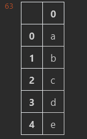

   

5. ##### 其他方法

   ~~~python
   # 从字典里生成
   pd.DataFrame.from_dict({'国家': ['中国', '美国', '日本'],'人口': [13.97, 3.28, 1.26]})
   # 从列表、元组、ndarray中生成
   pd.DataFrame.from_records([('中国', '美国', '日本'), (13.97, 3.28, 1.26)])
   # 列内容为一个字典
   pd.json_normalize(df.col)
   df.col.apply(pd.Series)
   ~~~

   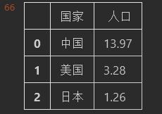

### 2.6 Pandas的数据类型

#### 2.6.1 数据类型查看

~~~python
import pandas as pd

df = pd.read_excel('team.xlsx')
df.dtypes	# 各字段的数据类型
df.team.dtype	# 查看某一个Series的数据类型
'''
name    object
team    object
Q1       int64
Q2       int64
Q3       int64
Q4       int64
dtype: object
'''
~~~

#### 2.6.2 常见数据类型

Pandas提供了以下常见的数据类型，**默认的数据类型是int64和float64，文字类型是object**。

float

int

bool

datetime64[ns]

datetime64[ns, tz]

timedelta64[ns]

timedelta[ns]

category

object

string

#### 2.6.4 数据检测

可以使用类型判断方法检测数据的类型是否与该方法中指定的类型一致，如果一致，则返回True，注意传入的是一个Series：

~~~stylus
pd.api.types.is_bool_dtype(s)
pd.api.types.is_categorical_dtype(s)
pd.api.types.is_datetime64_any_dtype(s)
pd.api.types.is_datetime64_ns_dtype(s)
pd.api.types.is_datetime64_dtype(s)
pd.api.types.is_float_dtype(s)
pd.api.types.is_int64_dtype(s)
pd.api.types.is_numeric_dtype(s)
pd.api.types.is_object_dtype(s)
pd.api.types.is_string_dtype(s)
pd.api.types.is_timedelta4_dtype(s)
~~~

# 第二部分 Pandas数据分析基础

## 第三章 Pandas数据读取与输出

Pandas可以将指定格式的数据读取到DataFrame中，并将DataFrame输出为指定格式的文件。

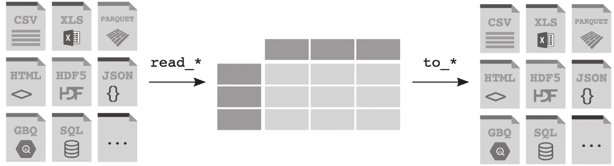

### 3.1 数据读取

常见数据的读取和输出函数

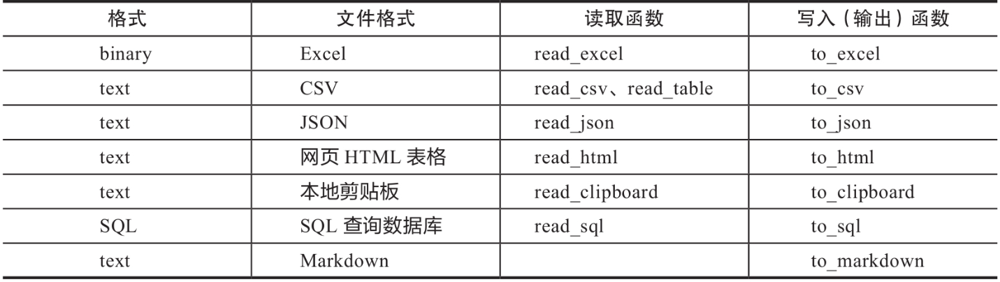

输入和输出的方法如下：

读取函数一般会赋值给一个变量df，df = pd.read_<xxx>()；_

输出函数是将变量自身进行操作并输出df.to_<xxx>()。

#### 3.1.1 CSV文件

~~~python
# 文件目录
pd.read_csv('data.csv') # 如果文件与代码文件在同一目录下
pd.read_csv('data/my/data.csv') # 指定目录
pd.read_csv('data/my/my.data') # CSV文件的扩展名不一定是.csv
# 使用URL
pd.read_csv('https://www.gairuo.com/file/data/dataset/GDP-China.csv')
~~~

#### 3.1.2 Excel

~~~python
# 返回DataFrame
pd.read_excel('team.xlsx') # 默认读取第一个标签页Sheet
pd.read_excel('path_to_file.xlsx', sheet_name='Sheet1') # 指定Sheet
# 从URL读取
pd.read_excel('https://www.gairuo.com/file/data/dataset/team.xlsx')
~~~

#### 3.1.3 JSON

~~~python
# data.json为同目录下的一个文件
pd.read_json('data.json')
# 解析JSON字符串
jdata='{"res":{"model":"iPhone","browser":"Safari","version":"604.1"},"status":200}'
pd.read_json(jdata)
'''
            res  status
browser  Safari     200
model    iPhone     200
version   604.1     200
'''
~~~

#### 3.1.4 HTML

pd.read_html()函数可以接受HTML字符串、HTML文件、URL，并将HTML中的<table>标签表格数据解析为DataFrame。如返回有多个df的列表，则可以通过索引取第几个。如果页面里只有一个表格，那么这个列表就只有一个DataFrame。此方法是Pandas提供的一个简单实用的实现爬虫功能的方法。

~~~python
dfs = pd.read_html('https://www.gairuo.com/p/pandas-io')
dfs[0] # 查看第一个df
# 读取网页文件，第一行为表头
dfs = pd.read_html('data.html', header=0)
# 第一列为索引
dfs = pd.read_html(url, index_col=0)
# 如果一个网页表格很多，可以指定元素来获取
# id='table'的表格，注意这里仍然可能返回多个
dfs1 = pd.read_html(url, attrs={'id': 'table'})
# dfs1[0]
# class='sortable'
dfs2 = pd.read_html(url, attrs={'class': 'sortable'})
~~~

#### 3.1.5 剪贴板

剪贴板（Clipboard）是操作系统级的一个暂存数据的地方，它保存在内存中，可以在不同软件之间传递，非常方便。Pandas支持读取剪贴板中的结构化数据，这就意味着我们不用将数据保存成文件，而可以直接从网页、Excel等文件中复制，然后从操作系统的剪贴板中读取，非常方便。

~~~python
'''
  x y z
a 1 2 3
b 4 5 6
c 7 8 9
'''

# 复制上边的数据，然后直接赋值
cdf = pd.read_clipboard()
~~~

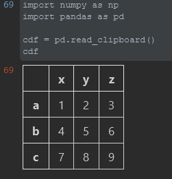

#### 3.1.6 SQL

略

### 3.2 读取CSV

略

### 3.3 读取Excel

#### 3.3.1 语法

~~~python
pd.read_excel(io, sheet_name=0, header=0,
              names=None, index_col=None,
              usecols=None, squeeze=False,
              dtype=None, engine=None,
              converters=None, true_values=None,
              false_values=None, skiprows=None,
              nrows=None, na_values=None,
              keep_default_na=True, verbose=False,
              parse_dates=False, date_parser=None,
              thousands=None, comment=None, skipfooter=0,
              convert_float=True, mangle_dupe_cols=True, **kwds)
~~~

#### 3.3.3 表格

sheet_name可以指定Excel文件读取哪个sheet，如果不指定，默认读取第一个。

~~~python
# 字符串、整型、列表、None，默认为0
pd.read_excel('tmp.xlsx', sheet_name=1) # 第二个sheet
pd.read_excel('tmp.xlsx', sheet_name='总结表') # 按sheet的名字

# 读取第一个、第二个、名为Sheet5的sheet，返回一个df组成的字典
dfs = pd.read_excel('tmp.xlsx', sheet_name=[0, 1, "Sheet5"])
dfs = pd.read_excel('tmp.xlsx', sheet_name=None) # 所有sheet
dfs['Sheet5'] # 读取时按sheet名
~~~

同时读取多个sheet举例：

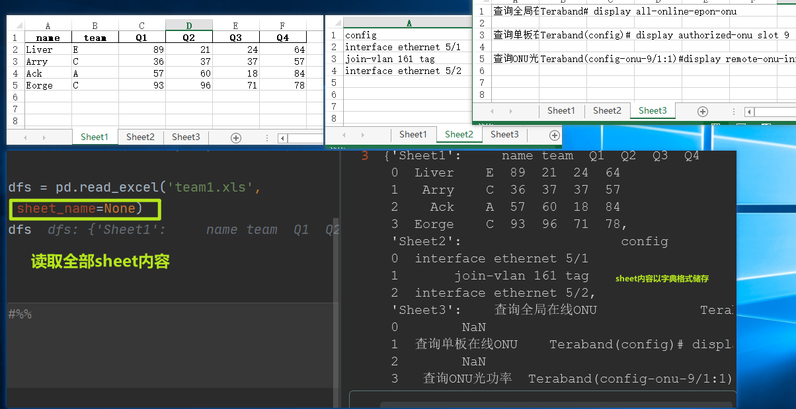

#### 3.3.4 表头

数据的表头参数为header，如不指定，默认为第一行。

~~~python
# 整型、整型组成的列表，默认为 0
pd.read_excel('tmp.xlsx', header=None)  # 不设表头
pd.read_excel('tmp.xlsx', header=2)  # 第三行为表头
pd.read_excel('tmp.xlsx', header=[0, 1])  # 两层表头，多层索引
~~~

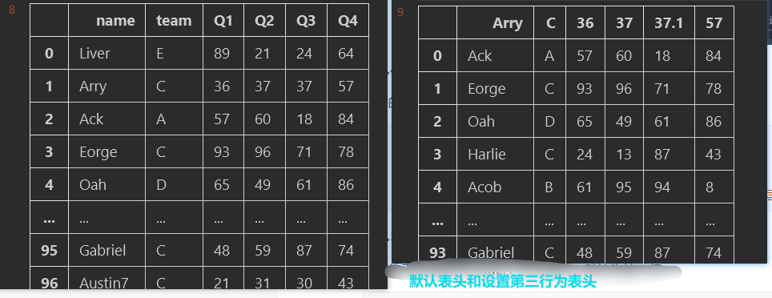

#### 3.3.5 列名

用names指定列名，也就是表头的名称，如不指定，默认为表头的名称。

~~~python
# 序列，默认为None
pd.read_excel('tmp.xlsx', names=['姓名', '年龄', '成绩'])
pd.read_excel('tmp.xlsx', names=c_list) # 传入列表变量
# 没有表头，需要设置为None
pd.read_excel('tmp.xlsx', header=None, names=None)
~~~

#### 3.3.6 索引（本小节及往下小节内容转自3.2读取CSV，与读取excel通用）

ndex_col用来指定索引列，可以是行索引的列编号或者列名，如果给定一个序列，则有多个行索引。**Pandas不会自动将第一列作为索引，不指定时会自动使用以0开始的自然索引**。

~~~powershell
# 支持int、str、int序列、str序列、False，默认为None
pd.read_csv(data, index_col=False) # 不再使用首列作为索引
pd.read_csv(data, index_col=0) # 第几列是索引
pd.read_csv(data, index_col='年份') # 指定列名
pd.read_csv(data, index_col=['a','b']) # 多个索引
pd.read_csv(data, index_col=[0, 3]) # 按列索引指定多个索引
~~~

#### 3.3.7 使用部分列

~~~python
# 支持类似列表的序列和可调用对象
# 读取部分列
pd.read_csv(data, usecols=[0,4,3]) # 按索引只读取指定列，与顺序无关
pd.read_csv(data, usecols=['列1', '列5']) # 按列名，列名必须存在
# 指定列顺序，其实是df的筛选功能
pd.read_csv(data, usecols=['列1', '列5'])[['列5', '列1']]
# 以下用callable方式可以巧妙指定顺序，in后面的是我们要的顺序
pd.read_csv(data, usecols=lambda x: x.upper() in ['COL3', 'COL1'])
~~~

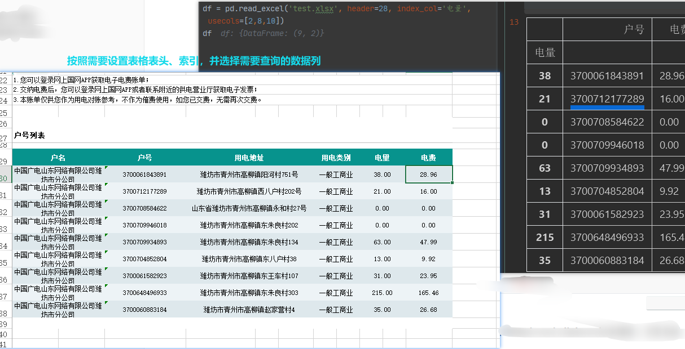

#### 3.3.8 返回序列

将squeeze设置为True，如果文件只包含一列，则返回一个Series，如果有多列，则还是返回DataFrame。

~~~python
# 布尔型，默认为False
# 下例只取一列，会返回一个Series
pd.read_csv(data, usecols=[0], squeeze=True)
# 有两列则还是df
pd.read_csv(data, usecols=[0, 2], squeeze=True)
~~~

#### 3.3.9 表头前缀

如果原始数据没有列名，可以指定一个前缀加序数的名称，如n0、n1，通过prefix参数指定前缀。

~~~python
# 格式为字符型str
# 表头为c_0、c_2
pd.read_csv(data, prefix='c_', header=None)
~~~

#### 3.3.10 处理重复列名

如果该参数为True，当列名有重复时，解析列名将变为X, X.1, …, X.N，而不是X,…, X。如果该参数为False，那么当列名中有重复时，前列将会被后列覆盖。

~~~python
# 布尔型，默认为True
data = 'a,b,a\n0,1,2\n3,4,5'
pd.read_csv(StringIO(data), mangle_dupe_cols=True)
# 表头为a b a.1
# False会报ValueError错误
~~~

#### 3.3.11 数据类型

dtype可以指定各数据列的数据类型

~~~python
# 传入类型名称，或者以列名为键、以指定类型为值的字典
pd.read_csv(data, dtype=np.float64) # 所有数据均为此数据类型
pd.read_csv(data, dtype={'c1':np.float64, 'c2': str}) # 指定字段的类型
pd.read_csv(data, dtype=[datetime, datetime, str, float]) # 依次指定
~~~

#### 3.3.12 列数据处理

使用converters参数对列的数据进行转换，参数中指定列名与针对此列的处理函数，最终以字典的形式传入，字典的键可以是列名或者列的序号。

~~~python
# 字典格式，默认为None
data = 'x,y\na,1\nb,2'
def foo(p):
    return p+'s'
# x应用函数，y使用lambda
pd.read_csv(StringIO(data), converters={'x': foo,
                                        'y': lambda x: x*3})
# 使用列索引
pd.read_csv(StringIO(data),
            converters={0: foo, 1: lambda x: x*3})
~~~

#### 3.3.13 真假值转换

使用true_values和false_values将指定的文本内容转换为True或False，可以用列表指定多个值。

~~~python
# 列表，默认为None
data = ('a,b,c\n1,Yes,2\n3,No,4')
pd.read_csv(StringIO(data),
            true_values=['Yes'], false_values=['No'])
~~~

#### 3.3.14 跳过指定行

如下跳过需要忽略的行数（从文件开始处算起）或需要忽略的行号列表（从0开始）：

~~~python
# 类似列表的序列或者可调用对象
# 跳过前三行
pd.read_csv(data, skiprows=2)
# 跳过前三行
pd.read_csv(data, skiprows=range(2))
# 跳过指定行
pd.read_csv(data, skiprows=[24,234,141])
# 跳过指定行
pd.read_csv(data, skiprows=np.array([2, 6, 11]))
# 隔行跳过
pd.read_csv(data, skiprows=lambda x: x % 2 != 0)

# 尾部跳过，从文件尾部开始忽略
# int类型, 默认为0
pd.read_csv(filename, skipfooter=1) # 最后一行不加载

# skip_blank_lines指定是否跳过空行，如果为True，则跳过空行，否则数据记为NaN。
# 如果skip_blank_lines=True，header参数将忽略空行和注释行，因此header=0表示第一行数据而非文件的第一行。
# 布尔型，默认为True
# 不跳过空行
pd.read_csv(data, skip_blank_lines=False)
~~~

#### 3.3.15 读取指定行

~~~python
# int类型，默认为None
pd.read_csv(data, nrows=1000)
~~~

#### 3.3.16 空值替换

na_values参数的值是一组用于替换NA/NaN的值。如果传参，需要指定特定列的空值。以下值默认会被认定为空值：

~~~js
['-1.#IND', '1.#QNAN', '1.#IND', '-1.#QNAN',
 '#N/A N/A', '#N/A', 'N/A', 'n/a', 'NA',
 '#NA', 'NULL', 'null', 'NaN', '-NaN',
 'nan', '-nan', '']
~~~

使用na_values时需要关注下面keep_default_na的配合使用和影响：

~~~python
# 可传入标量、字符串、类似列表序列和字典，默认为None
# 5和5.0会被认为是NaN
pd.read_csv(data, na_values=[5])
# ?会被认为是NaN
pd.read_csv(data, na_values='?')
# 空值为NaN
pd.read_csv(data, keep_default_na=False, na_values=[""])
# 字符NA和字符0会被认为是NaN
pd.read_csv(data, keep_default_na=False, na_values=["NA", "0"])
# Nope会被认为是NaN
pd.read_csv(data, na_values=["Nope"])
# a、b、c均被认为是NaN，等于na_values=['a','b','c']
pd.read_csv(data, na_values='abc')
# 指定列的指定值会被认为是NaN
pd.read_csv(data, na_values={'c':3, 1:[2,5]})
~~~

#### 3.3.17 保留默认空值

分析数据时是否包含默认的NaN值，是否自动识别。如果指定na_values参数，并且keep_default_na=False，那么默认的NaN将被覆盖，否则添加。

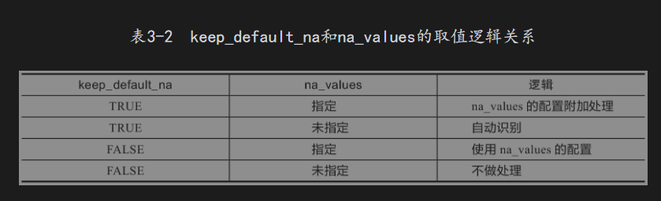

如果na_filter为False（默认为True），那么keep_default_na和na_values参数均无效。

~~~python
# 布尔型，默认为True
# 不自动识别空值
pd.read_csv(data, keep_default_na=False)
~~~

na_filter为是否检查丢失值（空字符串或空值）。对于大文件来说，数据集中没有空值，设定na_filter=False可以提升读取速度。

~~~python
# 布尔型，默认为True
pd.read_csv(data, na_filter=False) # 不检查
~~~

#### 3.3.18 日期时间解析

#### 3.3.19 文件处理

#### 3.3.20 符号

以上三个略

###### PS:对于一些量比较小的Excel数据文件，在做数据临时处理时，可以复制并使用**pd.read_clipboard()**来读取，非常方便。

### 3.4 数据输出

#### 3.4.1 CSV

~~~python
df.to_csv('done.csv')
df.to_csv('data/done.csv') # 可以指定文件目录路径
df.to_csv('done.csv', index=False) # 不要索引
~~~

另外还可以使用sep参数指定分隔符，columns传入一个序列指定列名，编码用encoding传入。如果不需要表头，可以将header设为False。如果文件较大，可以使用compression进行压缩：

~~~python
# 创建一个包含out.csv的压缩文件out.zip
compression_opts = dict(method='zip',
                        archive_name='out.csv')
df.to_csv('out.zip', index=False,
          compression=compression_opts)
~~~

#### 3.4.2 Excel

~~~python
# 导出，可以指定文件路径,文件扩展名必须是xls或者xlsx
df.to_excel('path_to_file.xlsx')
# 指定sheet名，不要索引
df.to_excel('path_to_file.xlsx', sheet_name='Sheet1', index=False)
# 指定索引名，不合并单元格
df.to_excel('path_to_file.xlsx', index_label='label', merge_cells=False)

# 将多个df分不同sheet导入一个Excel文件中
with pd.ExcelWriter('path_to_file.xlsx') as writer:
    df1.to_excel(writer, sheet_name='Sheet1')
    df2.to_excel(writer, sheet_name='Sheet2')
~~~

#### 3.4.3 HTML

DataFrame.to_html会将DataFrame中的数据组装在HTML代码的table标签中，输入一个字符串，这部分HTML代码可以放在网页中进行展示，也可以作为邮件正文。

~~~python
print(df.to_html())
print(df.to_html(columns=[0])) # 输出指定列
print(df.to_html(bold_rows=False)) # 表头不加粗
# 表格指定样式，支持多个
print(df.to_html(classes=['class1', 'class2']))
~~~

#### 3.4.4 数据库（SQL）

~~~python
# 需要安装SQLAlchemy库
from sqlalchemy import create_engine
# 创建数据库对象，SQLite内存模式
engine = create_engine('sqlite:///:memory:')
# 取出表名为data的表数据
with engine.connect() as conn, conn.begin():
    data = pd.read_sql_table('data', conn)

# data
# 将数据写入
data.to_sql('data', engine)
# 大量写入
data.to_sql('data_chunked', engine, chunksize=1000)
# 使用SQL查询
pd.read_sql_query('SELECT * FROM data', engine)
~~~

#### 3.4.5 Markdown

Markdown是一种常用的技术文档编写语言，Pandas支持输出Markdown格式的字符串，如下：

## 第4章 Pandas基础操作

### 4.1 索引操作

#### 4.1.1 认识索引

DataFrame索引示例

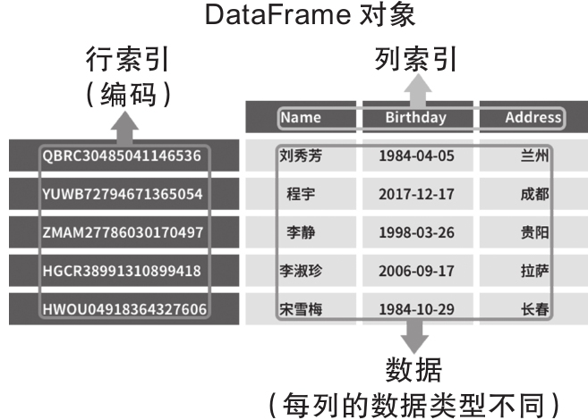

其中：

行索引是数据的索引，列索引指向的是一个Series；

DataFrame的索引也是系列形成的Series的索引；

建立索引让数据更加直观明确，每行数据是针对哪个主体的；

建立索引方便数据处理；

索引允许重复，但业务上一般不会让它重复。

#### 4.1.2 建立索引

~~~python
data = 'https://www.gairuo.com/file/data/dataset/team.xlsx'
df = pd.read_excel(data, index_col='name') # 将索引设置为name
df
'''
      team  Q1  Q2  Q3  Q4
name
Liver    E  89  21  24  64
Arry     C  36  37  37  57
Ack      A  57  60  18  84
Eorge    C  93  96  71  78
Oah      D  65  49  61  86
...
'''

# 如果加载时没有指定索引，可以使用df.set_index()指定
df = pd.read_excel(data) # 读取数据不设索引
df.set_index('name') # 设置索引

# 设置两层索引
df.set_index(['name', 'team']) # 设置两层索引
df.set_index([df.name.str[0],'name']) # 将姓名的第一个字母和姓名设置为索引
~~~

在以上操作中，我们并没有修改原来的df变量中的内容，如果希望用**设置索引后的数据替换原来df变量中的数据**，可以直接进行**赋值操作或者传入inplace参数**：

~~~python
df = df.set_index('name') # 建立索引并重写覆盖df
df.set_index('name', inplace=True) # 同上，使索引生效
~~~

~~~python
# 将一个Series指定为索引
s = pd.Series([i for i in range(100)])
df.set_index(s) # 指定一个索引
df.set_index([s, 'name']) # 同时指定索引和现有字段
df.set_index([s, s**2]) # 计算索引

# 两个常用的操作
df.set_index('month', drop=False) # 保留原列
df.set_index('month', append=True) # 保留原来的索引
~~~

#### 4.1.3 重置索引

~~~python
# 使用df.reset_index()取消已有索引
df.reset_index() # 清除索引
df.set_index('month').reset_index() # 相当于什么也没做
# 删除原索引，month列没了
df.set_index('month').reset_index(drop=True)
df2.reset_index(inplace=True) # 覆盖使生效
# year一级索引取消
df.set_index(['month', 'year']).reset_index(level=1)
df2.reset_index(level='class') # 同上，使用层级索引名
df.reset_index(level='class', col_level=1) # 列索引
# 不存在层级名称的填入指定名称
df.reset_index(level='class', col_level=1, col_fill='species')
~~~

#### 4.1.4 索引类型

~~~python
'''
数字索引（NumericIndex）共有以下几种。
RangeIndex：单调整数范围的不可变索引。
Int64Index：64位整型索引。
UInt64Index：无符号整数索引。
Float64Index：64位浮点型索引。
'''
pd.RangeIndex(1,100,2)
# RangeIndex(start=1, stop=100, step=2)
pd.Int64Index([1,2,3,-4], name='num')
# Int64Index([1, 2, 3, -4], dtype='int64', name='num')
pd.UInt64Index([1,2,3,4])
# UInt64Index([1, 2, 3, 4], dtype='uint64')
pd.Float64Index([1.2,2.3,3,4])
# Float64Index([1.2, 2.3, 3.0, 4.0], dtype='float64')
~~~

~~~python
'''
类别索引（CategoricalIndex）：类别只能包含有限数量的（通常是固定的）可能值（类别）。可以理解成枚举，比如性别只有男女，但在数据中每行都有，如果按文本处理会效率不高。类别的底层是pandas.Categorical。类别在第12章会专门讲解，只有在体量非常大的数据面前才能显示其优势。
'''
pd.CategoricalIndex(['a', 'b', 'a', 'b'])
# CategoricalIndex(['a', 'b', 'a', 'b'], categories=['a', 'b'], ordered=False,
    dtype='category')
~~~

~~~python
'''
间隔索引（IntervalIndex）代表每个数据的数值或者时间区间，一般应用于分箱数据。
'''
pd.interval_range(start=0, end=5)
'''
IntervalIndex([(0, 1], (1, 2], (2, 3], (3, 4], (4, 5]],
              closed='right',
              dtype='interval[int64]')
'''
~~~

#### 4.1.5 索引对象

~~~python
'''
行和列的索引在Pandas里其实是一个Index对象，以下是创建一个Index对象的方法：
'''
pd.Index([1, 2, 3])
# Int64Index([1, 2, 3], dtype='int64')
pd.Index(list('abc'))
# Index(['a', 'b', 'c'], dtype='object')
# 可以用name指定一个索引名称
pd.Index(['e', 'd', 'a', 'b'], name='something')
~~~

~~~python
'''
索引对象可以传入构建数据和读取数据的操作中。可以查看索引对象，列和行方向的索引对象如下：
'''
df.index
# RangeIndex(start=0, stop=4, step=1)
df.columns
# Index(['month', 'year', 'sale'], dtype='object')
~~~

#### 4.1.6 索引的属性

~~~python
'''
可以通过以下一系列操作查询索引的相关属性，以下方法也适用于df.columns，因为它们都是index对象。
'''
# 常用属性
df.index.name # 名称
df.index.array # array数组
df.index.dtype # 数据类型
df.index.shape # 形状
df.index.size # 元素数量
df.index.values # array数组
# 其他，不常用
df.index.empty # 是否为空
df.index.is_unique # 是否不重复
df.index.names # 名称列表
df.index.is_all_dates # 是否全是日期时间
df.index.has_duplicates # 是否有重复值
df.index.values # 索引的值array
~~~

#### 4.1.7 索引的操作

~~~python
'''
以下方法也适用于df.columns，因为都是index对象。
'''
# 常用方法
df.index.astype('int64') # 转换类型
df.index.isin() # 是否存在，见下方示例
df.index.rename('number') # 修改索引名称
df.index.nunique() # 不重复值的数量
df.index.sort_values(ascending=False,) # 排序，倒序
df.index.map(lambda x:x+'_') # map函数处理
df.index.str.replace('_', '') # str替换
df.index.str.split('_') # 分隔
df.index.to_list() # 转为列表
df.index.to_frame(index=False, name='a') # 转成DataFrame
df.index.to_series() # 转为series
df.index.to_numpy() # 转为numpy
df.index.unique() # 去重
df.index.value_counts() # 去重及计数
df.index.where(df.index=='a') # 筛选
df.index.rename('grade', inplace=False) # 重命名索引
df.index.rename(['species', 'year']) # 多层，重命名索引
df.index.max() # 最大值
df.index.argmax() # 最大索引值
df.index.any()
df.index.all()
df.index.T # 转置，在多层索引里很有用

# 其他，不常用
df.index.append(pd.Index([4,5])) # 追加
df.index.repeat(2) # 重复几次
df.index.inferred_type # 推测数据类型
df.index.hasnans # 有没有空值
df.index.is_monotonic_decreasing # 是否单调递减
df.index.is_monotonic # 是否有单调性
df.index.is_monotonic_increasing # 是否单调递增
df.index.nbytes # 基础数据中的字节数
df.index.ndim # 维度数，维数
df.index.nlevels # 索引层级数，通常为1
df.index.min() # 最小值
df.index.argmin() # 最小索引值
df.index.argsort() # 顺序值组成的数组
df.index.asof(2) # 返回最近的索引
# 索引类型转换
df.index.astype('int64', copy=True) # 深拷贝
# 拷贝
df.index.copy(name='new', deep=True, dtype='int64')
df.index.delete(1) # 删除指定位置
# 对比不同
df.index.difference(pd.Index([1,2,4]), sort=False)
df.index.drop('a', errors='ignore') # 删除
df.index.drop_duplicates(keep='first') # 去重值
df.index.droplevel(0) # 删除层级
df.index.dropna(how='all') # 删除空值
df.index.duplicated(keep='first') # 重复值在结果数组中为True
df.index.equals(df.index) # 与另一个索引对象是否相同
df.index.factorize() # 分解成（array:0-n, Index）
df.index.fillna(0, {0:'nan'}) # 填充空值
# 字符列表，把name值加在第一位，每个值加10
df.index.format(name=True, formatter=lambda x:x+10)

# 返回一个array，指定值的索引位数组，不在的为-1
df.index.get_indexer([2,9])
# 获取指定层级Index对象
df.index.get_level_values(0)
# 指定索引的位置，见示例
df.index.get_loc('b')
df.index.insert(2, 'f') # 在索引位2插入f
df.index.intersection(df.index) # 交集
df.index.is_(df.index) # 类似is检查
df.index.is_categorical() # 是否分类数据
df.index.is_type_compatible(df.index) # 类型是否兼容

df.index.is_type_compatible(1) # 类型是否兼容
df.index.isna() # array是否为空
df.index.isnull() # array是否缺失值
df.index.join(df.index, how='left') # 连接
df.index.notna() # 是否不存在的值
df.index.notnull() # 是否不存在的值
df.index.ravel() # 展平值的ndarray
df.index.reindex(['a','b']) # 新索引 (Index,array:0-n)
df.index.searchsorted('f') # 如果插入这个值，排序后在哪个索引位
df.index.searchsorted([0, 4]) # array([0, 3]) 多个
df.index.set_names('quarter') # 设置索引名称
df.index.set_names('species', level=0)
df.index.set_names(['kind', 'year'], inplace=True)
df.index.shift(10, freq='D') # 日期索引向前移动10天
idx1.symmetric_difference(idx2) # 两个索引不同的内容
idx1.union(idx2) # 拼接

df.add_prefix('t_') # 表头加前缀
df.add_suffix('_d') # 表头加后缀
df.first_valid_index() # 第一个有值的索引
df.last_valid_index() # 最后一个有值的索引
~~~

#### 4.1.8 索引重命名

将一个数据列置为索引后，就不能再像修改列名那样修改索引的名称了，需要使用df.rename_axis方法。它不仅可以修改索引名，还可以修改列名。需要注意的是，这里修改的是索引名称，不是索引或者列名本身。

~~~python
s.rename_axis("student_name") # 索引重命名
df.rename_axis(["dow", "hr"]) # 多层索引修改索引名
df.rename_axis('info', axis="columns") # 修改行索引名
# 修改多层列索引名
df.rename_axis(index={'a': 'A', 'b': 'B'})
# 修改多层列索引名
df.rename_axis(columns={'name': 's_name', 'b': 'B'})
df.rename_axis(columns=str.upper) # 行索引名变大写
~~~

#### 4.1.9 修改索引内容

~~~python
'''
用来修改行和列的索引名的主要函数是df.rename和df.set_axis。df.rename可以给定一个字典，键是原名称，值是想要修改的名称，还可以传入一个与原索引等长度序列进行覆盖修改，用一个函数处理原索引名。以下是一些具体的使用方法举例：
'''
# 一一对应修改列索引
df.rename(columns={"A": "a", "B": "c"})
df.rename(str.lower, axis='columns')
# 修改行索引
df.rename(index={0: "x", 1: "y", 2: "z"})
df.rename({1: 2, 2: 4}, axis='index')
# 修改数据类型
df.rename(index=str)
# 重新修改索引
replacements = {l1:l2 for l1, l2 in zip(list1, list2)}
df.rename(replacements)
# 列名加前缀
df.rename(lambda x:'t_' + x, axis=1)
# 利用iter()函数的next特性修改
df.rename(lambda x, y=iter('abcdef'): next(y), axis=1)
# 修改列名，用解包形式生成新旧字段字典
df.rename(columns=dict(zip(df, list('abcd'))))

# df.set_axis可以将所需的索引分配给给定的轴，通过分配类似列表或索引的方式来更改列标签或行标签的索引。
# 修改索引
df.set_axis(['a', 'b', 'c'], axis='index')
# 修改列名
df.set_axis(list('abcd'), axis=1)
# 使修改生效
df.set_axis(['a', 'b'], axis='columns', inplace=True)
# 传入索引内容
df.set_axis(pd.Index(list('abcde')), axis=0)
~~~

### 4.2 数据的信息

#### 4.2.1 查看样本

~~~python
df = pd.read_excel('https://www.gairuo.com/file/data/dataset/team.xlsx')
s = df.Q1 # 取其中一列，形成Series
df.head() # 查看前5条数据
'''
    name team  Q1  Q2  Q3  Q4
0  Liver    E  89  21  24  64
1   Arry    C  36  37  37  57
2    Ack    A  57  60  18  84
3  Eorge    C  93  96  71  78
4    Oah    D  65  49  61  86
'''

# 其他常用方法
df.head(10) # 查看前10条数据
s.tail() # 查看后5条数据
df.tail(10) # 查看后10条数据
df.sample() # 随机查看一条数据
s.sample(3) # 随机查看3条数据
~~~

#### 4.2.2 数据形状（行列数）

~~~python
# 执行df.shape会返回一个元组，该元组的第一个元素代表行数，第二个元素代表列数，这就是这个数据的基本形状，也是数据的大小。
df.shape
# (100, 6)
# 共100行6列（索引不算）

# Series 只有一个值
s.shape
# (100,)
~~~

#### 4.2.3 基础信息

~~~python
'''
执行df.info会显示所有数据的类型、索引情况、行列数、各字段数据类型、内存占用等。Series不支持。
'''
df.info
'''
<class 'pandas.core.frame.DataFrame'>
RangeIndex: 100 entries, 0 to 99
Data columns (total 6 columns):
 #   Column  Non-Null Count  Dtype
---  ------  --------------  -----
 0   name    100 non-null    object
 1   team    100 non-null    object
 2   Q1      100 non-null    int64
 3   Q2      100 non-null    int64
 4   Q3      100 non-null    int64
 5   Q4      100 non-null    int64
dtypes: int64(4), object(2)
memory usage: 4.8+ KB
'''
~~~

#### 4.2.4 数据类型

~~~python
# df.dtypes会返回每个字段的数据类型及DataFrame整体的类型。
df.dtypes
'''
name    object
team    object
Q1       int64
Q2       int64
Q3       int64
Q4       int64
dtype: object
'''

# 如果是Series，需要用s.dtype：
s.dtype
# dtype('int64')
~~~

#### 4.2.5  行列索引内容

~~~python
# df.axes会返回一个列内容和行内容组成的列表[列索引, 行索引]。
df.axes
'''
[RangeIndex(start=0, stop=100, step=1),
 Index(['name', 'team', 'Q1', 'Q2', 'Q3', 'Q4'], dtype='object')]
'''

# Series显示列索引，就是它的索引：
s.axes
# [RangeIndex(start=0, stop=100, step=1)]
~~~

#### 4.2.6 其他信息

~~~python
# 索引对象
df.index
# RangeIndex(start=0, stop=100, step=1)
# 列索引，Series不支持
df.columns
# Index(['name', 'team', 'Q1', 'Q2', 'Q3', 'Q4'], dtype='object')
df.values # array(<所有值的列表矩阵>)
df.ndim # 2 维度数
df.size # 600行×列的总数，就是总共有多少数据
# 是否为空，注意，有空值不认为是空
df.empty # False
# Series的索引，DataFrame的列名
df.keys()

# Series独有方法
s.name # 'Q1'，获取索引的名称
s.array # 值组成的数组 <PandasArray>
s.dtype # 类型，dtype('int64')
s.hasnans # False
~~~

### 4.3 统计计算

Pandas可以对Series与DataFrame进行快速的描述性统计，如求和、平均数、最大值、方差等，这些是最基础也最实用的统计方法。对于DataFrame，这些统计方法会按列进行计算，最终产出一个以列名为索引、以计算值为值的Series。

#### 4.3.1 描述统计

~~~python
'''
df.describe()会返回一个有多行的所有数字列的统计表，每一行对应一个统计指标，有总数、平均数、标准差、最小值、四分位数、最大值等
'''
df.describe()
'''
               Q1          Q2          Q3          Q4
count  100.000000  100.000000  100.000000  100.000000
mean    49.200000   52.550000   52.670000   52.780000
std     29.962603   29.845181   26.543677   27.818524
min      1.000000    1.000000    1.000000    2.000000
25%     19.500000   26.750000   29.500000   29.500000
50%     51.500000   49.500000   55.000000   53.000000
75%     74.250000   77.750000   76.250000   75.250000
max     98.000000   99.000000   99.000000   99.000000
'''
~~~

~~~python
'''
如果没有数字，则会输出与字符相关的统计数据，如数量、不重复值数、最大值（字符按首字母顺序）等。
'''
pd.Series(['a', 'b', 'c', 'c']).describe()
'''
count     4
unique    3
top       c
freq      2
dtype: object
'''
~~~

#### 4.3.2 数学统计

~~~python
df.mean() # 按列计算平均数
'''
Q1    49.20
Q2    52.55
Q3    52.67
Q4    52.78
dtype: float64
'''
type(df.mean())
# pandas.core.series.Series

# Series应用数学统计函数一般会给出一个数字定值，直接计算出这一列的统计值
df.Q1.mean()
s.mean()
# 49.2
~~~

~~~python
# 计算行平均数，可以传入axis参数，列传index或0，行传columns或1
df.mean(axis='columns')
df.mean(axis=1) # 效果同上
df.mean(1) # 效果同上
'''
0     49.50
1     41.75
2     54.75
3     84.50
4     65.25
      ...
95    67.00
96    31.25
97    53.00
98    58.50
99    44.75
Length: 100, dtype: float64
'''
~~~

~~~python
# 创建name为索引，计算每行平均值，只看前5条
df.set_index('name').mean(1).head()
'''
name
Liver    49.50
Arry     41.75
Ack      54.75
Eorge    84.50
Oah      65.25
dtype: float64
'''
~~~

#### 4.3.3 统计函数

~~~python
df.mean() # 返回所有列的均值
df.mean(1) # 返回所有行的均值，下同
df.corr() # 返回列与列之间的相关系数
df.count() # 返回每一列中的非空值的个数
df.max() # 返回每一列的最大值
df.min() # 返回每一列的最小值
df.abs() # 绝对值
df.median() # 返回每一列的中位数
df.std() # 返回每一列的标准差，贝塞尔校正的样本标准偏差
df.var() # 无偏方差
df.sem() # 平均值的标准误差
df.mode() # 众数
df.prod() # 连乘
df.mad() # 平均绝对偏差
df.cumprod() # 累积连乘，累乘
df.cumsum(axis=0) # 累积连加，累加
df.nunique() # 去重数量，不同值的量
df.idxmax() # 每列最大值的索引名
df.idxmin() # 每列最小值的索引名
df.cummax() # 累积最大值
df.cummin() # 累积最小值
df.skew() # 样本偏度（第三阶）
df.kurt() # 样本峰度（第四阶）
df.quantile() # 样本分位数（不同 % 的值）
~~~

#### 4.3.4 非统计计算

~~~python
df.all() # 返回所有列all()值的Series
df.any()

# 四舍五入
df.round(2) # 指定字段指定保留小数位，如有
df.round({'Q1': 2, 'Q2': 0})
df.round(-1) # 保留10位

# 每个列的去重值的数量
df.nunique()
s.nunique() # 本列的去重值

# 真假检测
df.isna() # 值的真假值替换
df.notna() # 与上相反
~~~

~~~python
# 以下可以传一个值或者另一个DataFrame，对数据进行广播方式计算，返回计算后的DataFrame
df + 1 # 等运算
df.add() # 加
df.sub() # 减
df.mul() # 乘
df.div() # 除
df.mod() # 模，除后的余数
df.pow() # 指数幂
df.dot(df2) # 矩阵运算
~~~

~~~python
# Series专有函数
# 不重复的值及数量
s.value_counts()
s.value_counts(normalize=True) # 重复值的频率
s.value_counts(sort=False) # 不按频率排序

s.unique() # 去重的值 array
s.is_unique # 是否有重复

# 最大最小值
s.nlargest() # 最大的前5个
s.nlargest(15) # 最大的前15个
s.nsmallest() # 最小的前5个
s.nsmallest(15) # 最小的前15个

s.pct_change() # 计算与前一行的变化百分比
s.pct_change(periods=2) # 前两行

s1.cov(s2) # 两个序列的协方差
~~~

### 4.4 位置计算

略

### 4.5 数据选择

完成选择一列、选择一行、按组合条件筛选数据等操作。

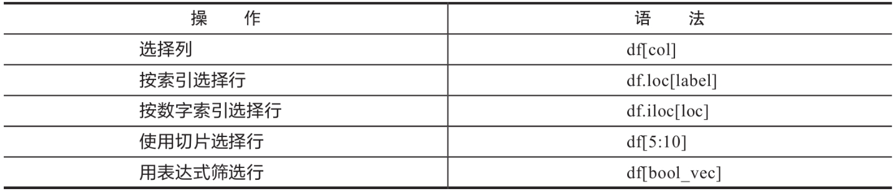

#### 4.5.1 选择列

~~~python
# 选取一列数据
df['name'] # 会返回本列的Series, 下同
df.name
df.Q1
'''
0     89
1     36
2     57
3     93
4     65
      ..
95    48
96    21
97    98
98    11
99    21
Name: Q1, Length: 100, dtype: int64
'''

type(df.Q1)
# pandas.core.series.Series
~~~

#### 4.5.2 切片[]

~~~python
df[:2] # 前两行数据
df[4:10]
df[:] # 所有数据，一般不这么用
df[:10:2] # 按步长取
s[::-1] # 反转顺序
df[2] # 报错！不支持仅索引一条数据
~~~

~~~python
# 切片里是一个列名组成的列表，则可筛选出这些列
df[['name','Q4']]
'''
        name  Q4
0      Liver  64
1       Arry  57
2        Ack  84
3      Eorge  78
4        Oah  86
..       ...  ..
95   Gabriel  74
96   Austin7  43
97  Lincoln4  20
98       Eli  91
99       Ben  74

[100 rows x 2 columns]
'''

df[['name']] # 选择一列，返回DataFrame，注意与下例进行区分
df['name'] # 只有一列，返回Series
~~~

#### 4.5.3 按轴标签.loc

df.loc的格式是df.loc[<行表达式>, <列表达式>]，**如列表达式部分不传，将返回所有列**，Series仅支持行表达式进行索引的部分。loc操作通过索引和列的条件筛选出数据。如果仅返回一条数据，则类型为Series。

​                                                                               **df.loc的使用方法**

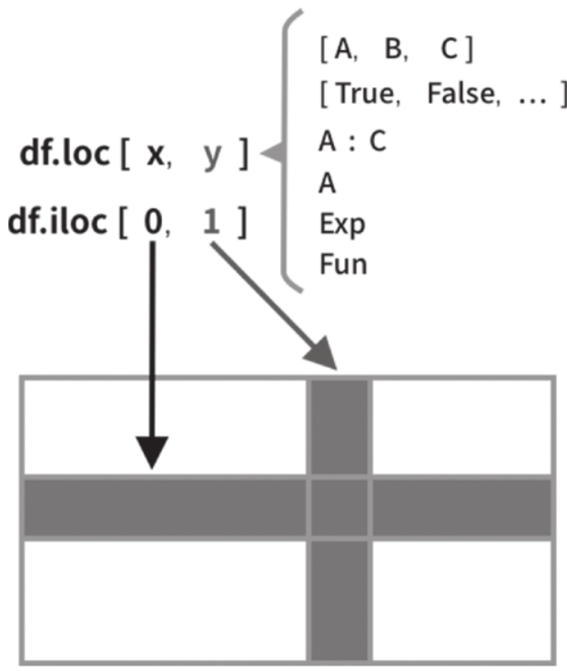

~~~python
# 单个索引示例
# 代表索引，如果是字符，需要加引号
df.loc[0] # 选择索引为0的行
df.loc[8]

# 索引为name
df.set_index('name').loc['Ben']
'''
team     E
Q1      21
Q2      43
Q3      41
Q4      74
Name: Ben, dtype: object
'''
~~~

~~~python
# 多个索引示例
# 列表组成的索引
df.loc[[0,5,10]] # 指定索引为0，5，10的行
'''
      name team  Q1  Q2  Q3  Q4
0    Liver    E  89  21  24  64
5   Harlie    C  24  13  87  43
10     Leo    B  17   4  33  79
'''

df.set_index('name').loc[['Eli', 'Ben']] # 两位学生，索引是name
df.loc[[False, True]*50] # 为真的列显示，隔一个显示一个
# 带标签的切片（包括起始和停止）
df.loc[0:5] # 索引切片，代表0～5行，包括5
df.loc['2010':'2014'] # 如果索引是时间，可以用字符查询，第14章会介绍
df.loc[:] # 所有
# 本方法支持Series
~~~

~~~python
# 附带列筛选，必须有行筛选。列部分的表达式可以是一个由希望筛选的表名组成的列表，也可以是一个用冒号隔开的切片形式，来表示从左到右全部包含，左侧和右侧可以分别省略，表示本侧所有列。
df.loc[0:5, ['name', 'Q2']]
'''
     name  Q2
0   Liver  21
1    Arry  37
2     Ack  60
3   Eorge  96
4     Oah  49
5  Harlie  13
'''

df.loc[0:9, ['Q1', 'Q2']] # 前10行，Q1和Q2两列
df.loc[:, ['Q1', 'Q2']] # 所有行，Q1和Q2两列
df.loc[:10, 'Q1':] # 0～10行，Q1后边的所有列
df.loc[:, :] # 所有内容
~~~

#### 4.5.4 按数字索引.iloc

~~~python
# 与loc[]可以使用索引和列的名称不同，利用df.iloc[<行表达式>, <列表达式>]格式可以使用数字索引（行和列的0～n索引）进行数据筛选，意味着iloc[]的两个表达式只支持数字切片形式，其他方面是相同的。
df.iloc[:3] # 前三行
s.iloc[:3] # 序列中的前三个
df.iloc[:] # 所有数据
df.iloc[2:20:3] # 步长为3
df.iloc[:3, [0,1]] # 前两列
df.iloc[:3, :] # 所有列
df.iloc[:3, :-2] # 从右往左第三列以左的所有列

~~~

#### 4.5.5 取具体值.at/.iat

~~~python
# .at类似于loc，仅取一个具体的值，结构为df.at[<索引>,<列名>]。如果是一个Series，可以直接值入索引取到该索引的值。
# 注：索引是字符，需要加引号
df.at[4, 'Q1'] # 65
df.set_index('name').at['Ben', 'Q1'] # 21 索引是name
df.at[0, 'name'] # 'Liver'
df.loc[0].at['name'] # 'Liver'
# 指定列的值对应其他列的值
df.set_index('name').at['Eorge', 'team'] # 'C'
df.set_index('name').team.at['Eorge'] # 'C'
# 指定列的对应索引的值
df.team.at[3] # 'C'
~~~

~~~python
# iat和iloc一样，仅支持数字索引
df.iat[4, 2] # 65
df.loc[0].iat[1] # 'E'
~~~

#### 4.5.6 获取数据.get

.get可以做类似字典的操作，如果无值，则返回默认值（下例中是0）。格式为df.get(key, default=None)，**如果是DataFrame，key需要传入列名，返回的是此列的Series；如果是Series，需要传入索引，返回的是一个定值**。

~~~python
df.get('name', 0) # 是name列
df.get('nameXXX', 0) # 0，返回默认值
s.get(3, 0) # 93，Series传索引返回具体值
df.name.get(99, 0) # 'Ben'
~~~

#### 4.5.7 数据截取.truncate

df.truncate()可以对DataFrame和Series进行截取，可以将索引传入before和after参数，将这个区间以外的数据剔除。

~~~python
df.truncate(before=2, after=4)
'''
    name team  Q1  Q2  Q3  Q4
2    Ack    A  57  60  18  84
3  Eorge    C  93  96  71  78
4    Oah    D  65  49  61  86
'''

s.truncate(before=2, after=4)

~~~

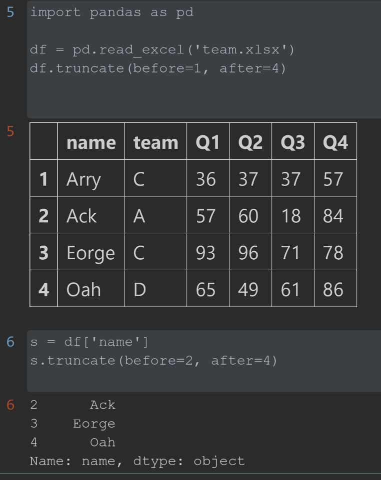

#### 4.5.8 索引选择器

pd.IndexSlice是一个专门的索引选择器，它的使用方法类似df.loc[]切片中的方法，常用在多层索引中，以及需要指定应用范围（subset参数）的函数中，特别是在链式方法中。

~~~python
df.loc[pd.IndexSlice[:, ['Q1', 'Q2']]]
# 变量化使用
idx = pd.IndexSlice
df.loc[idx[:, ['Q1', 'Q2']]]
df.loc[idx[:, 'Q1':'Q4'], :] # 多索引
# 创建复杂条件选择器
selected = df.loc[(df.team=='A') & (df.Q1>90)]
idxs = pd.IndexSlice[selected.index, 'name']
# 应用选择器
df.loc[idxs]
# 选择这部分区域加样式
df.style.applymap(style_fun, subset=idxs)
~~~

## 第5章 Pandas高级操作

### 5.1 复杂查询

